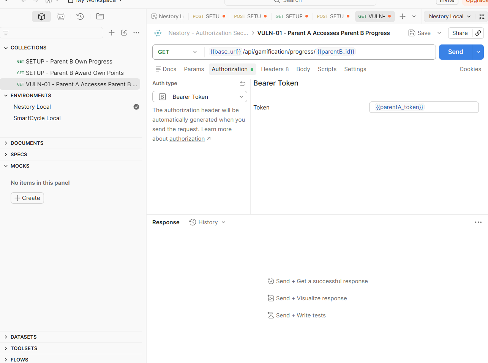
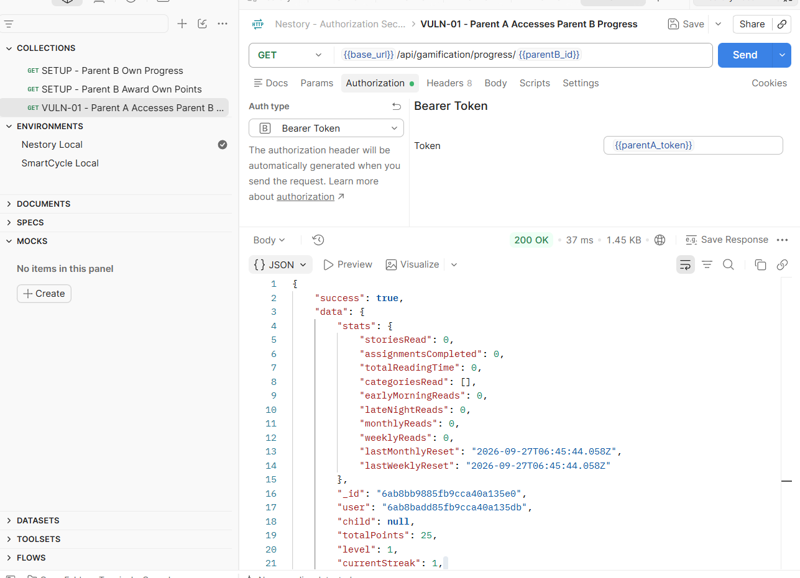
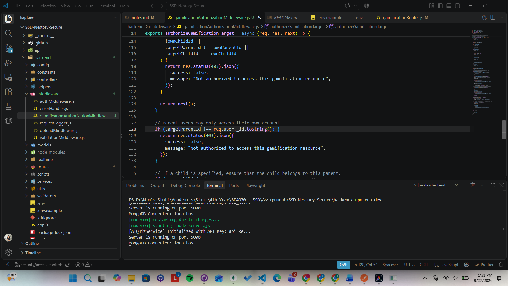
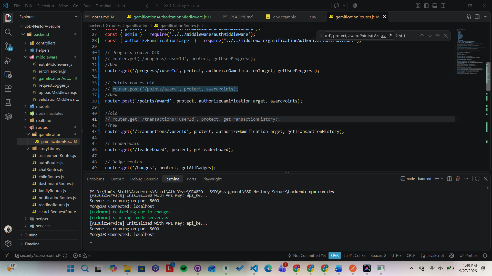
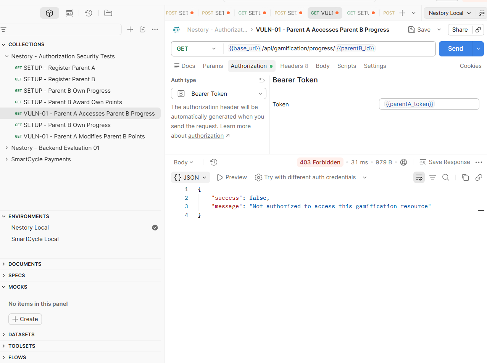
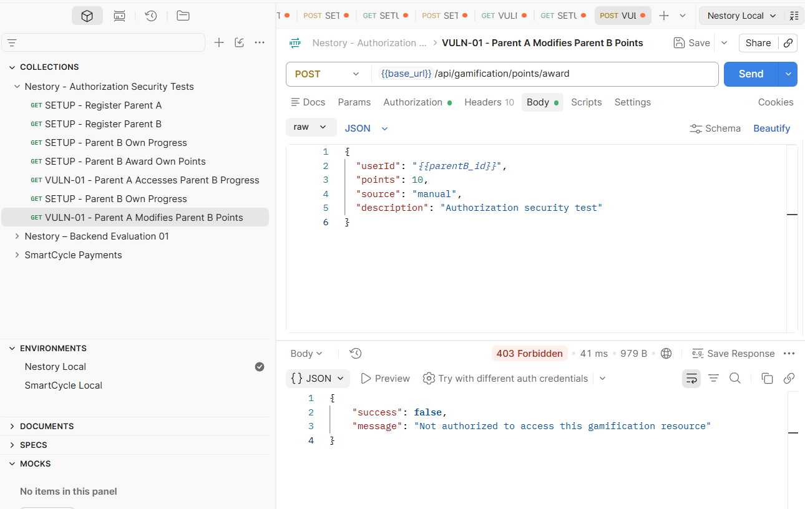
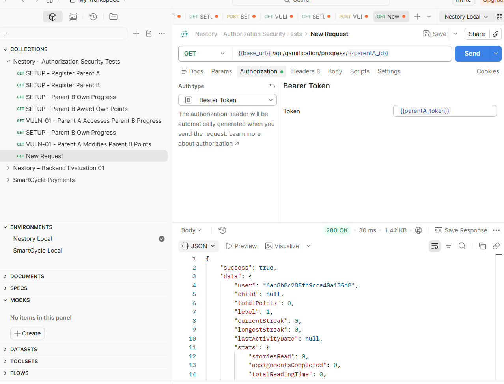

# Vulnerability 1 - Broken Object Level Authorization in Gamification APIs

## Status
Confirmed / Fixed

## Owner
Member 2: Authorization, Resource Ownership and Role Security

## Category
OWASP API1: 2023 - Broken Object Level Authorization (BOLA)
CWE-639: Authorization Bypass Through User Controlled Key

# Affected Area
Gamification APIs

## Root Cause
Several Gamification endpoints accept user controlled identifiers such as userId, childId or challengeID

The current code appears to use these identifoers to access or midofy gamification resources without consistently verifying that the authenticated requester is authorized to access the referenced user, child, or challenge.

## Example Functions
- getUserProfress()
- awardPoints()
- awardBadge()
- updateAchievementProgress()
- getUserBadges()
- getUserAchievements()
- getTransactionHistory()
- getTodayChallenge()
- updateTodayChallengeProgress()

## Test Scenario
Parent A attempts to access or modify Parent B / Child B gamification data
using Parent A's valid authentication token together with Parent B's userId
or Child B's childId.

## Expected Secure Result
The server should reject unauthorized cross-account access, normally with HTTP 403 Forbidden.

## Actual Result
The request was authenticated using Parent A's valid JWT while the requested resource identifier belonged to Parent B.
The server returned HTTP 200 OK and exposed Parent B's gamification progress, including the point balance and progress information.
This confirms that the endpoint authenticates the requester but does not adequately enforce object-level authorization for the requested user resource

## Security Impact
An authenticated user can manipulate the user identifier in the gamification progress endpoint to retrieve another user's gamification
information.
This results in unauthorized cross-account data access and affects the confidentiality of user gamification information.

## Before-Fix Evidence

### Unauthorized Read Request
Parent A's valid authentication token was used while requesting Parent B's gamification resource.

### Unauthorized Read Response
The server returned HTTP 200 OK and exposed Parent B's gamification progress.

### Unauthorized Modification Request
Parent A attempted to award points to Parent B.

### Unauthorized Modification Response
The server accepted the cross-account modification and updated Parent B's point balance.

## Fix
A reusable gamification authorization middleware was introduced.
The middleware compares the requested user/child resource with the authenticated user stored in req.user.

Parent accounts are restricted to their own account and children.
Child accounts are restricted to their own linked child profile.
Admin accounts retain authorized administrative access.

The middleware was applied to gamification endpoints that accept userId or childId identifiers.

## After Result
The original cross-account requests were repeated using Parent A's authentication token and Parent B's user identifier.
Both unauthorized read and modification attempts were rejected with HTTP 403 Forbidden.

## Result
Fixed

## Fix Evidence

### Authorization Middleware
The following code shows the reusable ownership and authorization check introduced for gamification resources.

### Protected Gamification Routes
The authorization middleware was added after authentication and before the relevant gamification controllers.

## After-Fix Verification

### Test 1 — Unauthorized Cross-Account Read
Parent A's authentication token was used together with Parent B's user identifier.
The request was rejected with HTTP 403 Forbidden.

### Test 2 — Unauthorized Cross-Account Modification
Parent A attempted to award points to Parent B using Parent A's valid authentication token.
The request was rejected with HTTP 403 Forbidden.

### Regression Test — Legitimate Own Access
Parent A requested Parent A's own gamification resource after the fix.

The request returned HTTP 200 OK, confirming that legitimate access
continued to work while cross-account access was blocked.

## Preventive Best Practice

Authorization checks should be implemented server-side and should never rely solely on client-supplied object identifiers.
Resource ownership should be validated using the authenticated user's server-side identity before any sensitive read or modification is performed.
Reusable authorization middleware helps apply these checks consistently across related endpoints.